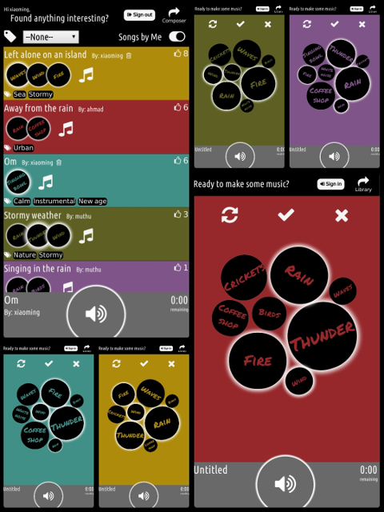

# Zzzz Mixer  

A single-page app built in React for sharing sleep music.

Deployed at [https://zmixer.daburu.xyz](https://zmixer.daburu.xyz)

### Motivation

### Tools, APIs & Frameworks
- React
- React-router
- React animation
- CouchDB
- PouchDB
- Auth0
- Web audio
- Howler.js
- Webpack
