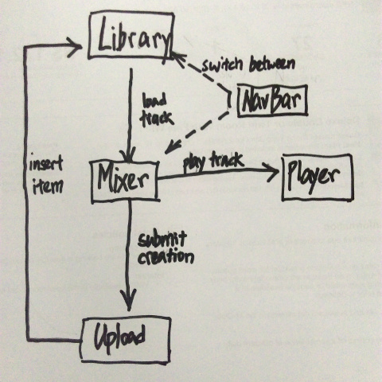

# Zzzz Mixer  

A sleep music mixer single-page app built in React.

Deployed at [https://zmixer.daburu.xyz](https://zmixer.daburu.xyz)

### Motivation
This is my 3rd project for General Assembly's Web Development Immersive. The objective is to make a single-page app and we are allowed to use any front-end framework. I decided to work with  React. The idea for making this app comes from an Android app [Relax Melodies](https://play.google.com/store/apps/details?id=ipnossoft.rma.free&hl=en) which I had been using to catch some sleep during long bus trips. The app allows you to mix your own sleep music by  layering various smoothing ambient sounds and melodies into one playback loop. For example you can recreate a "cabin in the woods" surrounding by mixing the sound of howling wind together with rustling leaves and a ringing wind chime. You can then save your customized track into a favourite list.

While being able to mix sound is a great feature to have, I realized most users probably aren't patient enough to experiment with all the available sound samples (total 52 in the paid version) and make really interesting music with them. Won't it be better if the favourite list is something made public so everyone can explore the works of everyone else? Not only can we listen to other people's work, we can also build on top of other people's work so the list keeps growing and new users have access to a potentially long list of pre-mixed themes right from the start. Therefore, with this idea of making sleep music shareable, I set out on creating Zzzz Mixer.

### Building the App

##### 1. Components and States
This is my first try at writing a React app. The difficulty is in getting used to the React way of thinking. The blog post [Thinking in React](https://facebook.github.io/react/docs/thinking-in-react.html) by Pete Hunt had been a great help in getting me started: setting up the components, conceptualizing all the possible application states and figuring out which components to house these states so as to support React's one-way data-binding. For a start, these are the components I created:

- Player
- Music library
- Compose area
- Upload form
- Navigation bar
- Sound bubble

##### 2. Setting up web audio
The fun part is the player component as I get to play around with web audio. Web audio API's native way to play a sound sample is to fire an [AudioBufferSourceNode](https://developer.mozilla.org/en-US/docs/Web/API/AudioBufferSourceNode). The problem with AudioBufferSourceNode is that it is designed to be "fired once and forget". Additional logic is required even for simple playback functionalities like pause and play. Therefore I used [howler.js](http://goldfirestudios.com/blog/104/howler.js-Modern-Web-Audio-Javascript-Library) to abstract away from manually implementing pause and play.

##### 3. Views and Routing
I used [React Router](https://github.com/reactjs/react-router) to handle which components should be mounted in each view. Below is an overview of the application views structure:

##### 4. Backend

###### 4.1 Audio files
As long as internet connection is good, audio files can be served directly from the server as static resources. However, to cut down data transfer and speed up loading of audio file, we can do better by implementing local storage for downloaded audio samples. First time user will retrieve audio samples over the net. Subsequent access will fetch from the local cache.

###### 4.2 Music library
The simplicity of using layered sample loops is that each mix is only defined by the audio sample that went into it. So instead of storing the mixed track binary, I only need to store reference to the selected sound samples and their relative volume. This small packet of data along with the original set of sound samples is sufficient to regenerate any mix created by the user. My choice of database is [PouchDB](http://pouchdb.com/) on client-side syncing with a [CouchDB](http://couchdb.apache.org/) database in the cloud.

##### 5. Authentication and Logins
This app is also my first time using [Auth0](https://auth0.com/lock) lock API. The trick is figuring out how to collect user credential from the URL hash returned by the login widget.

##### 6. Styling & Transition
After setting up all the moving parts, the final step is styling the components. I experimented with [React animation](https://facebook.github.io/react/docs/animation.html) by setting up my components to enter and exit with transitions.

##### 0. Organizing the project directory
I had been using Browserify for my previous web projects. This time round, because I'm using [Webpack](https://webpack.github.io/) with React, I experimented with a different directory structure. Previously I will have a js folder holding all my js source codes and a css folder holding all my style sheets. For my React project, each component is a separate folder containing an index.js file and a style.css file. This results in a more organized project directory and takes advantage of Webpack's ability to bundle css files together with js sources.

### Tools, APIs & Frameworks Used
- React
- React-router
- React animation
- CouchDB
- PouchDB
- Auth0
- Web audio
- howler.js
- Webpack
